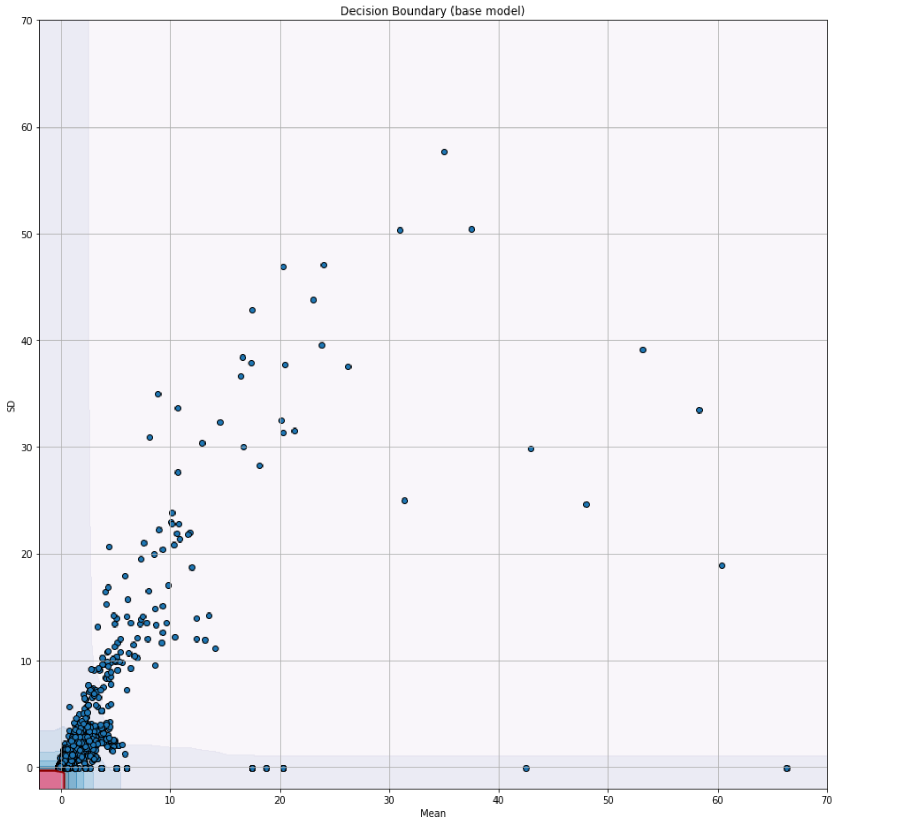
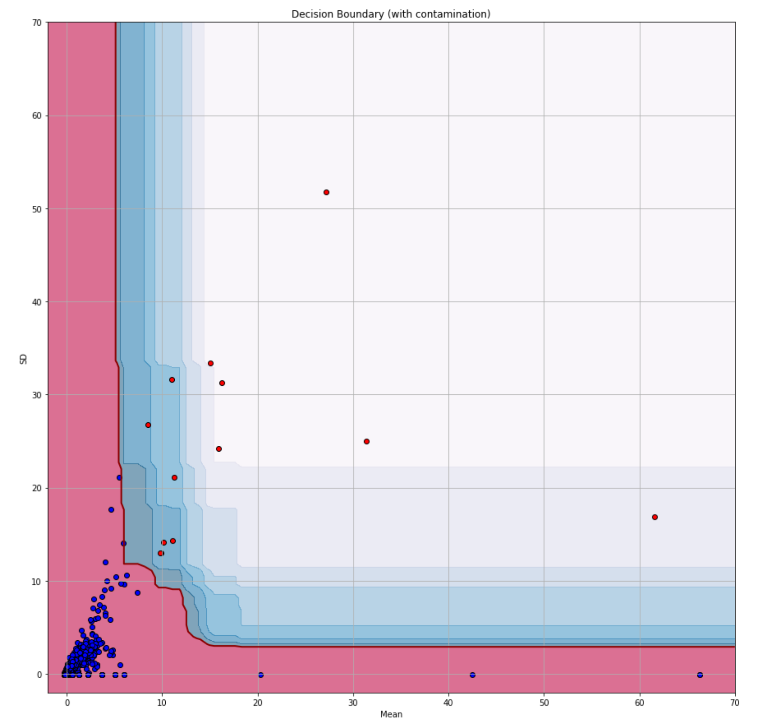

# liveProject-anomalyDetection

## Part 1

### 1.1 Objective
Define a Docker image that runs a Jupyter server. Next, create a Jupyter notebook by accessing Jupyter from the host machine. In Milestones 2 and 3, we will use this Jupyter notebook to explore the dataset and train the anomaly detection model.

### 1.2 Importance

- Running processes in Docker containers is a common practice in the industry for many reasons, including the portability and ease of sharing images, its ability to run almost everywhere, the isolation it provides, and because you can avoid installing dependencies on your machine.
- By defining, building, and running a Docker image, we’ll start to familiarize ourselves with some of the terms we will use in the project: for example, image and container.
- We will use the same Jupyter notebook we just created to analyze our dataset and train the model.
- We will create another Dockerfile to run the web service using a similar approach in a later milestone.

### 1.3 Workflow

1. Create a new directory and name it “liveProject.” This location is the working directory and is where we will develop our project.
2. Within the directory, create a second directory and name it “jupyter.” Then, in the Jupyter directory, create a Dockerfile. This Dockerfile represents the image we will use to run Jupyter.
3. In the Dockerfile, define as base a Python image. A smaller one like `python:3.7-slim` should suffice. Then, use the `RUN` instruction with the command `mkdir src` to create a `/src` directory inside the container. Use the `WORKDIR` instruction to set `/src` as the working directory.
4. In the Dockerfile, add another `RUN` that installs Jupyter using pip, which is the Python package installer.
5. Next, use the `CMD` instruction to specify the command that starts the Jupyter server.
    - Because we are inside a Docker container and we want to access Jupyter from the outside, we need to use the following options while starting the Jupyter server: `no-browser` and `allow-root`. Besides this, I’d recommend using the `ip` and `port` options to explicitly define the IP and port where the server will run. You could use the IP address `0.0.0.0`.
6. After defining the Dockerfile, on the terminal, use Docker’s `build` command to build the image using the name `{your_name}/lp-jupyter`: for example, `juan/lp-jupyter`.
7. Run the Docker image using the publish or expose option (`-p`) to forward the port you used in the second `CMD` command to the local machine. The command that runs the Docker image is named `run`. This command will run the Docker image and start the Jupyter server. After running it, you will see on screen the address where Jupyter is running. Click on it to access it.
8. From Jupyter, create a new notebook and print “hello, world.”

## Part 2

### 2.1 Objective

Explore and visualize the dataset we will use to train the anomaly detector.

### 2.2 Importance

- Analyzing and visualizing a dataset is an essential step when working with data. With three visualizations, we will examine the shape of the training dataset and its details. Furthermore, we will discover that the data’s features are very far from resembling a bell-shaped, normal distribution and instead are skewed by many observations we could consider outliers. Armed with this knowledge, will be better prepared to fit a model using the data, which we will do in the next milestone.
- Besides visualizing the dataset, we will learn how to get a statistical summary of the data with the `describe()` function. This function reports several statistical properties of the data, such as its mean and standard deviation values, quantiles, and count.
- We will use Plotly, a visualization library, to interactively visualize the data. Out of the box, Plotly adds a widget on the plot with various controls for zooming in, resizing, autoscaling, panning, saving the image as a PNG file, and more. Besides this, without having to do extra work, a Plotly graph provides additional information, such as the data points’ values, box plot attributes (the fences and quantiles), and histogram bucket information by just hovering over them using the mouse. These values are useful data we can always examine when doing an exploratory data analysis.

### 2.3 About the Dataset

Our project’s dataset is a sample of a real-life dataset obtained from the author’s organization, LOVOO, which is a dating and social application. This dataset presents two features related to the users’ spending patterns of the in-app currency (named credit) during a particular period. The first feature, mean, is the normalized average amount of credit a user has spent during that time while the second feature, sd, is the standard deviation (also normalized). During the dataset analysis, you will see that most values are concentrated in the same region while others are very far from the tendency. In some cases, these abnormal values are outliers or anomalies—users whose spending behaviors differ from the normality.

### 2.4 Workflow

1. Add the training (train.csv) and test (test.csv) datasets to the liveProject/jupyter/ directory from the previous milestone.
2. Create a requirements.txt file and define the libraries we will use to analyze the dataset. Some of the libraries we need are pandas (to work with the dataset) and Plotly (to visualize it). Feel free to add others you might find convenient.
3. In the same Dockerfile from Milestone 1, add a `COPY` instruction to copy requirements.txt into the working directory (see Milestone 1, step 3). Next, use the `RUN` instruction to install the packages from requirements.txt.
4. Build the Docker image as we did in Milestone 1, step 6.
5. Now, we will start the Jupyter service by using the same instruction from Milestone 1, step 7.
    1. On this occasion, because we want to use the datasets in the notebooks, we need to use a bind mount in the container. Quoting the official Docker documentation, “When you use a bind mount, a file or directory on the host machine is mounted into a container.” In other words, you will be able to access a directory of the host machine from within the Docker container. The directory we will mount, also known as the source, is the current directory liveProject/jupyter/ (the one containing the datasets and the Dockerfile). The target (the path in the container where we want to bind the source directory) is the container’s working directory (/src).
    2. To create it, use the `-v` or `--mount` flag in the `docker run` command.
6. Once the server is running, go to Jupyter and create a new notebook named exploration.
    1. With the notebook up and running, import pandas and Plotly from the first cell. Then, use pandas to load both the training and test datasets into a pandas DataFrame. If the directory was correctly mounted, you should see both datasets in the list of files.
7. Visualize and examine the dataset by doing the following:
    1. Use the DataFrame’s `head()` method to print the dataset’s first five rows. Seeing a sample of the data is a practical way to get an idea of its shape, data types, and entries. If you wish to see more, change the n parameter to the desired number of rows.
    2. Call the dataset’s `shape` attribute to print the dataset’s dimensionality. The output is a tuple of size two, where the first value is the DataFrame’s numbers of rows, and the second is the number of columns.
    3. Use the method `describe()` to calculate descriptive statistics for the dataset’s two features. This method prints a table containing each feature’s count (number of entries), mean value, standard deviation, minimum and maximum values, and percentiles. These statistics summarize the data in terms of its central tendency and explain how dispersed it is. For example, the summary of the training set shows that the first feature’s minimum and maximum values are -0.284889 and 66.324763, and those of the second feature are -0.106749 and 57.676982, meaning that the first feature has a longer range than the second one.
    4. With Plotly, draw a scatter plot where the x axis is the dataset’s mean feature and the y axis is the sd feature. Each point in the graph represents one data observation from the dataset. Similar to the statistical summary, a scatter plot is a tool for exploring a dataset and its characteristics. Even though it doesn’t give us precise values like the statistical summary, it allows us to visually and empirically test the data. For example, the training set’s scatter plot shows that most values are within the 0 to 10 range. If you hover over the data points using the mouse, you will see the data point’s value. For example, if you move the cursor over the right-most point, you will see that the mean feature value is 66.324, which should also be the maximum value for that feature as seen on the `describe()` function’s output.
    5. Use two histograms to visualize both features’ distributions with the parameter nbins set to 20. Due to very large values in both features, the distributions should look highly right skewed, meaning that many of its values are less than the mean. As a result, the plot’s peak is on the left end of the graph.
    6. Last, we draw two box plots (again, one per feature). A box plot is a visualization for representing the spread of the data and its quantiles. Its name is because it uses a box and two lines (known as whiskers), where the ends of the box mark the first (Q1) and third quartile (Q3), and the whiskers are the lower and upper limits. These lower and upper limits are calculated by their respective formulas: `Q1 – 1.5 * (Q3-Q1)` and `Q3 + 1.5 * (Q3-Q1)`. The values falling outside these limits are categorized as outliers. At a quick glance, the box plots show the outlier data points above the upper limit and a horizontal line instead of a box—this line is the box! But we see it flat instead of squared because the distance between Q3 and Q1 (known as the interquartile range) is extremely small compared to the large outlier values. However, because Plotly graphs are interactive, you can zoom in until the line starts to resemble a box. You can find an example of some of these visualizations in the “full solution” help layer.
8. Save the notebook.

## Part 3

### 3.1 Objective

Train an anomaly detection model using the Isolation forest model. We also export the model and visualize its decision boundary.

### 3.2 Importance

- In this milestone, we will create an anomaly detection model, which we could consider the center and key component of the platform. Later, we will serve the model using a web service and generate metrics.
- Besides training the model, we will explore the concept of anomaly detection and one of its most popular algorithms, Isolation Forest. Regarding the algorithm itself, we quickly describe it and introduce one of its most crucial hyperparameters: contamination.
- While working with the model, we will also learn about the concept of a decision boundary and how to visualize it using the function decision_function() and Matplotlib.

### 3.3 About Isolation Forest

**Isolation Forest** (Fei Tony Liu, Kai Ming Ting, and Zhi-Hua Zhou, 2008) is an unsupervised learning algorithm for identifying anomalies, or data observations that follow a different pattern than in normal instances. Unlike most anomaly detection algorithms, which work by learning the normal or common patterns and classifying the rest as anomalies, an isolation forest focuses on isolating the anomalies and not the normal cases. According to the authors, the drawback of the first approach is that these methods are optimized for profiling the normal instances and not the anomalies and their constraint to perform well in only low-dimensional data. On the other hand, isolation forests focus on the property that anomalies are usually the minority class among a dataset and that their features differ from the normal ones. As a result, and quoting the paper, “Anomalies are ‘few and different,’ which make[s] them more susceptible to isolation than normal points.”

### 3.4 About Makefile

By this point, we have executed the Docker run command at least three times; and that’s great because now we know how to use it. However, typing such a large and verbose command takes time, and it’s prone to errors. To streamline the process, I’d suggest using a makefile. A makefile is a building automation tool consisting of a file named makefile (without extension). This makefile consists of named rules that, upon executing them, execute a system command, like an alias. For example, we could have a rule named run whose system command is `docker run -v $(PWD):/src -p 8888:8888 {your_name}/lp-jupyter`. So instead of executing the Docker command, we could use `make run`. Shorter, right? The makefile file should look as follows:

```
run:
    docker run -v $(PWD):/src -p 8888:8888 {your_name}/lp-jupyter
```

To use it, execute `make run` from the terminal while same in the path as the makefile.

### 3.5 Workflow

1. Picking up where we last left off (the liveProject/jupyter/ directory), add scikit-learn and Matplotlib to our list of requirements in requirements.txt.
2. Build the Docker image.
3. Start the Docker image as we did in Milestone 2, step 5, and access Jupyter. From Jupyter, create a new notebook and name it train.
4. Our tasks in this milestone are loading the dataset, training the model, and visualizing its decision boundary. Therefore, in the notebook’s first cell, import pandas, NumPy, Matplotlib, and scikit-learn’s Isolation forest class.
5. Load both the training and test datasets.
6. Now, we will train the model.
    1. To train it, create an instance of an `IsolationForest` model and use the parameter `random_state` set to `16` for reproducibility purposes. You can find the model’s documentation at `sklearn.ensemble.IsolationForest`. Assigning this parameter ensures that we will all obtain the same results. Why 16? It’s just a random number; there’s no particular reason.
    2. Use the method `model.fit()` with the loaded training set as a parameter to train it. That’s it; we have the model. Wait, do we? Let’s take a look.
7. **Note:** As we saw in the introduction, an isolation forest isolates the anomalous points from the non-anomalous points. In layman’s terms, we could say that it builds a frontier that separates these anomalous points from the non-anomalous points. This frontier is sometimes known as the decision boundary or decision function, and we can obtain it by using as a proxy the anomaly scores obtained with the method `model.decision_function()` and the input samples. In the next step, we will visualize it.
8. Draw the model’s decision function.
    1. Drawing the boundary is not a trivial problem. Hence, here’s a snippet that does it (code was modified from an official scikit-learn example). But before you copy/paste, let’s quickly go through it and discuss it.
    ```python
    import matplotlib.pyplot as plt

    # Change the plot's size.
    plt.rcParams['figure.figsize'] = [15, 15]

    # Plot of the decision frontier
    xx, yy = np.meshgrid(np.linspace(-2, 70, 100), np.linspace(-2, 70, 100))
    Z = clf.decision_function(np.c_[xx.ravel(), yy.ravel()])
    Z = Z.reshape(xx.shape)
    plt.title("Decision Boundary (base model)")
    # This draw the "soft" or secondary boundaries.
    plt.contourf(xx, yy, Z, levels=np.linspace(Z.min(), 0, 8), cmap=plt.cm.PuBu, alpha=0.5)
    # This draw the line that separates the hard from the soft boundaries.
    plt.contour(xx, yy, Z, levels=[0], linewidths=2, colors='darkred')
    # This draw the hard boundary
    plt.contourf(xx, yy, Z, levels=[0, Z.max()], colors='palevioletred')
    plt.scatter(X_train.iloc[:, 0],
                X_train.iloc[:, 1],
                edgecolors='k')
    plt.xlabel('Mean')
    plt.ylabel('SD')
    plt.grid(True)
    plt.show()
    ```
    2. The main idea behind the visualization involves generating many points, covering the range of both features of the training set and predicting the anomaly scores of these generated points with the `decision_function()` function (note that I named my model variable `clf`; yours might have a different name). After predicting, we draw the generated points using Matplotlib’s contour plot to see the “ripples” (the different boundary levels). After drawing it, you will see a “hard” boundary in red and “soft” boundaries in different shades of blue. Make sure you also add the training set (I named mine `X_train`; yours might have a different name) to the plot using `plt.scatter()`.
    3.  Copy/paste the snippet above to draw the decision boundary. The image that follows shows how the plot should look.
    
9. Let’s take this milestone step to interpret what we see here. The plot you have on screen is the decision boundary of the isolation forest. Everything within the red region is what I call the “hard” decision boundary. It contains the inliers, or normal points. The rest are the outliers, or anomalies. Here, we can barely see the red region; it is extremely small compared to the rest of the space. Yet, it contains most of the points (around 85%) of the training dataset. However, the remaining 15% is still a lot of data, and it is probable that many of these points are data points that aren’t extremely anomalous or points that might even be false positives. So, for this case, it would be wise to increase the decision boundary’s size, thus also reducing the points that would be classified as outliers. How? By using the contamination hyperparameter. See note 1 in the Notes section below.
10. Retrain the model using the `contamination` hyperparameter set to `0.001`. This hyperparameter controls the proportion of outliers in the dataset, so we will force the model to build its decision function with the constraint that only 0.1% of the data observations are outliers. With this hyperparameter, we will drastically reduce and control the outliers’ space.
11. Replot the decision boundary of the new model. Notice the difference? In this new model, the hard decision boundary covers more space than the previous one, leaving us with values that could be considered extremely anomalous.
12. Use the model’s `predict()` method to test it with the test dataset. The function returns an array with the predictions where each value is either -1 (outlier) or 1 (inlier).
13. Once again, plot the decision boundary, but instead of drawing the training set, draw the test dataset and color code the inliers with blue and the outliers with red. You could do so by merging the test dataset with the predictions produced in step 12 and using one `plt.scatter()` to plot the data observations where the prediction label is `-1` and another where the label is `1`. To merge the data, you could use the pandas `concat()` function like this: `pd.concat([X_test, pd.Series(test_predictions)], axis=1)`, where `test_predictions` are the predictions from step 12. If everything works as planned, all the inliers are inside the red region and the outliers are in the blue one. The resulting plot should look similar to this one.

14. Export the model to the host machine using the package joblib (it comes with scikit-learn’s installation). For details on how to do this, see the Resources section.
